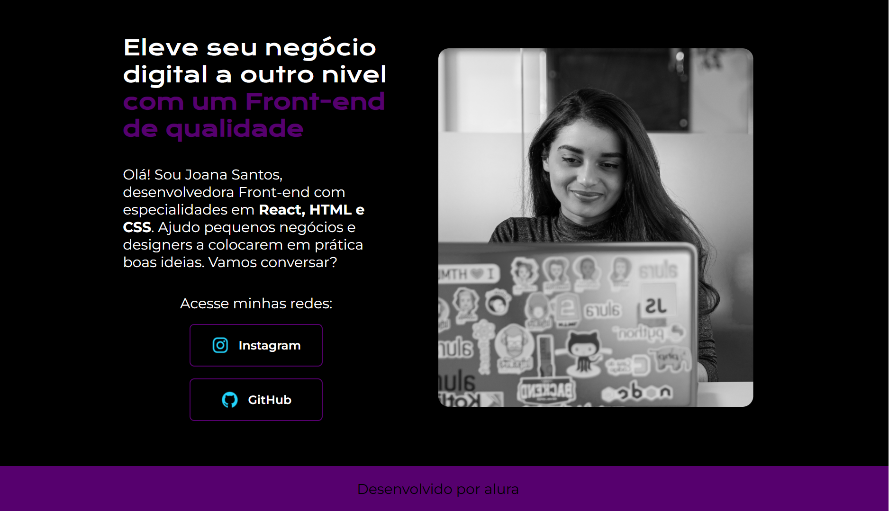

# CP-tela-1---alura
Este projeto é um portfólio responsivo e estilizado, desenvolvido em HTML e CSS, com o objetivo de apresentar o trabalho da desenvolvedora Joana Santos. O design moderno, combinado com uma boa organização de estilos, destaca as habilidades em React, HTML e CSS, além de oferecer links para redes sociais e um rodapé personalizado.

----------------------------------------------------------------------------------------------------------------------------------------
Funcionalidades

Navegação por Menu:

Links para as páginas: "Home", "Sobre Mim" e "Currículo".
Estilização com realce ao passar o cursor sobre os links (efeito hover).
Seção de Apresentação:

Texto introdutório com título chamativo e estilização diferenciada.
Parágrafo apresentando habilidades e uma chamada para conexão.
Links para Redes Sociais:

* Botões estilizados com ícones (Instagram e GitHub), responsivos a interações (hover).
Imagem de Destaque:

* Foto da desenvolvedora para personalização e identificação visual.
Rodapé Personalizado:

* Créditos ao projeto e combinação de cores que fecham o design.
Design Responsivo:

* Adaptação automática para dispositivos menores (menos de 1200px), reorganizando elementos e centralizando o menu de navegação.

----------------------------------------------------------------------------------------------------------------------------------------
 Tecnologias Utilizadas:

* HTML5: Estruturação semântica e organização do conteúdo.

* CSS3: Estilização avançada, com:
Variáveis CSS para reaproveitamento de cores e fontes.
Flexbox para disposição e alinhamento.
Media Queries para responsividade.

* Google Fonts: Integração das fontes "Krona One" e "Montserrat" para uma tipografia moderna.